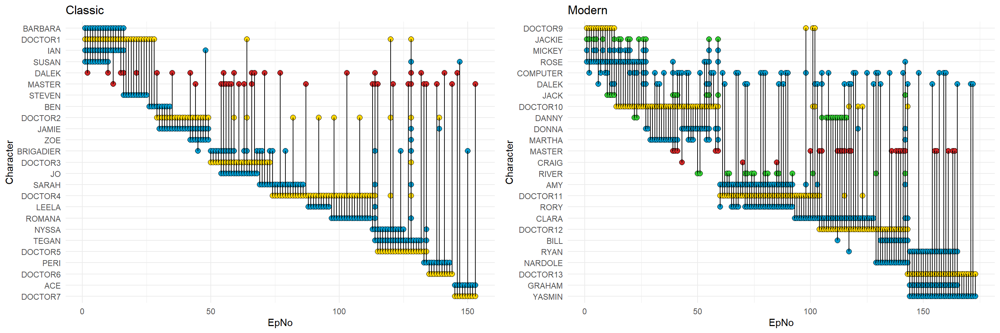

# Doctor Who (1963-2022) Dataset construction, EDA and ML applications

Repo showing various data science applications to webscraped and processed Doctor Who episodes from the modern and classic seasons, including python webcrawling for data, large scale text processing, exploratory data analysis and visualisation, network construction and analysis and various machine learning applications.

Using R and Python.

This project written up at: lawrence-archer.co.uk/DocWhoEDA

Visualizations below generated by DocWho.Rmarkdown

)
